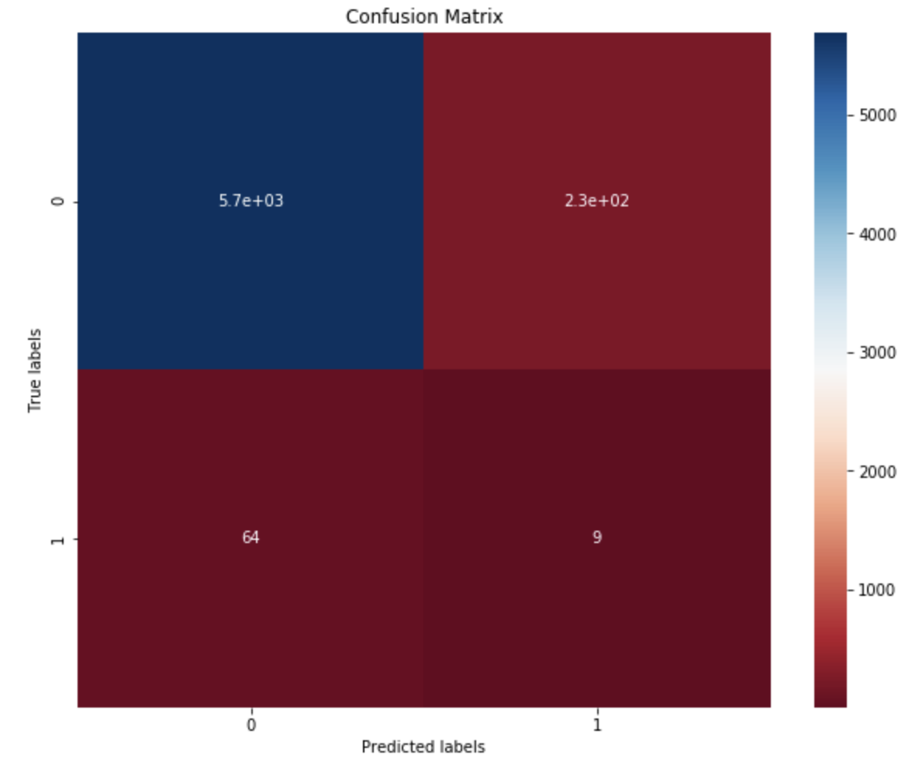
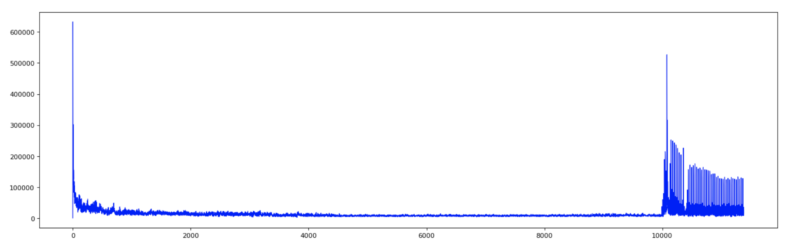
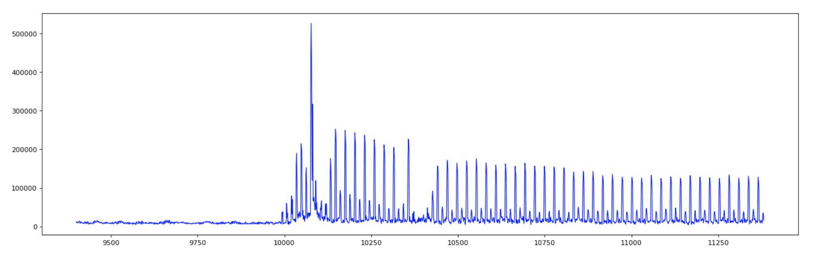

# LSTM_Anomaly_Detection

This repo contains the analysis of a gaming firm's production logs.
Using this data I build models to predict if a user will install a product after being shown an advertisement.

The analysis starts with traditional models used for predicting clicks. Then switch over to treating the problem as an anomaly detection using a LSTM.
To learn the latent space of observation that don't clicks

I initially start with testing and comparing individual models then move on to ensemble models and finally a LSTM.

Data is withheld for privacy of firm but you are free to run the model with your own data that match the features of the model.
To run model give your columns the same names as the ones used in the analysis and execute the following command:

```python test_data.csv```

The results will be a csv with the following columns

```
id: site visitor id

install_prob: probability the user decides to install
```


#### Confusion matrix of random forest model:



Model parameters:

```
RandomForestClassifier(bootstrap=True, class_weight=None, criterion='gini',
                       max_depth=4, max_features=7, max_leaf_nodes=None,
                       min_impurity_decrease=0.0, min_impurity_split=None,
                       min_samples_leaf=1, min_samples_split=10,
                       min_weight_fraction_leaf=0.0, n_estimators=10,
                       n_jobs=None, oob_score=False, random_state=None,
                       verbose=0, warm_start=True)
```

#### Charts of LSTM results

### LSTM

### Zoomed in LSTM


Observations 1 to 9990  is the model learning the latent space of observations that do not choose to install after being shown an ad (training).
Observations 9990 to 11350 are mix of observations that do and do not install after being shown an ad (testing).
The spikes in the chart from observations 9990 to 11350 are are the model predictions for visitors who will choose to install after being shown an ad.


#### Ted Thompson

##### 2017
